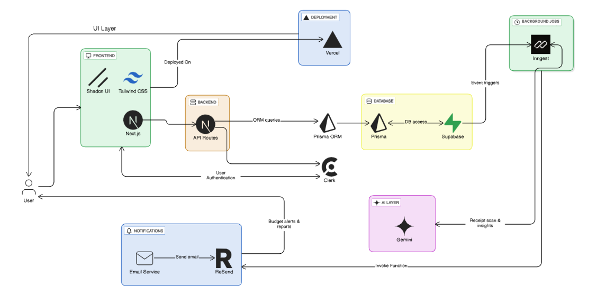
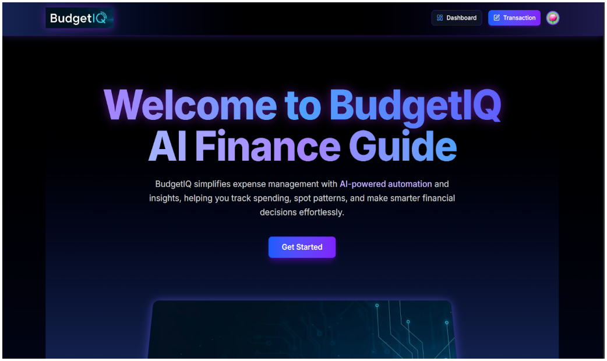
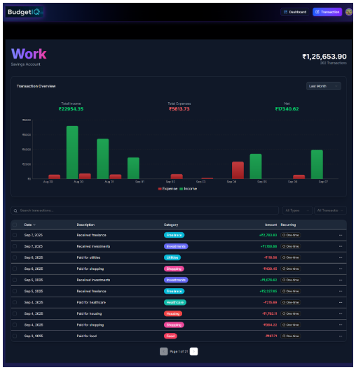

# BudgetIQ

**BudgetIQ** is a full-stack personal finance management platform designed to simplify budgeting, track expenses, and optimize financial decisions using AI-powered insights.

## Features

- **AI Receipt Scan** – Automatically extract and categorize transactions from receipts.  
- **Manual Transaction Management** – Add, edit, and categorize income and expenses.  
- **Recurring Transactions** – Schedule and automate regular payments and income entries.  
- **Dashboard Analytics** – Visualize spending patterns with charts and graphs.  
- **Secure & Reliable** – Built with modern tech for a seamless and safe experience.  
- **PWA Ready** – Can be converted into a mobile app for on-the-go financial tracking.

## Tech Stack

- **Frontend:** Next.js, Tailwind CSS  
- **Backend:** Supabase, Prisma  
- **AI & APIs:** Gemini API for AI receipt scanning  
- **Email Notifications:** Resend  
- **Deployment:** Vercel / Netlify (optional for production)  

## Installation

1. Clone the repository:  
   ```bash
   git clone https://github.com/yourusername/BudgetIQ.git
   cd BudgetIQ

2. Install dependencies:
```bash
    npm install
```
3. Set up environment variables in a .env file:
```bash
NEXT_PUBLIC_SUPABASE_URL=your_supabase_url 
NEXT_PUBLIC_SUPABASE_ANON_KEY=your_supabase_anon_key
GEMINI_API_KEY=your_gemini_api_key
RESEND_API_KEY=your_resend_api_key
```

4. Run the development server:
```bash 
npm run dev
```

5. Open http://localhost:3000
 to view the app.


## Usage

- **Add Transaction:** Navigate to `Add Transaction` → choose manual or AI scan → enter details → save.  
- **Dashboard:** View categorized expenses, income, and financial trends.  
- **Recurring Transactions:** Set up monthly, weekly, or custom recurring payments.  
- **Reports:** Download or view transaction summaries for budgeting insights.

## Screenshots


System Architecture Diagram

---


Landing Page

---


Insight Page


## License

This project is licensed under the MIT License.
